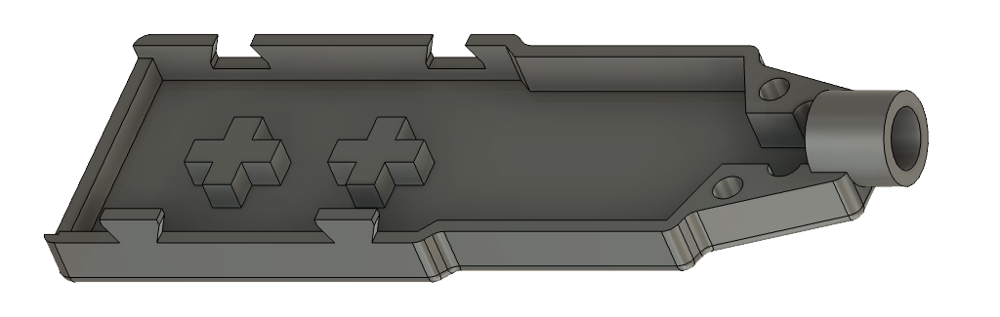
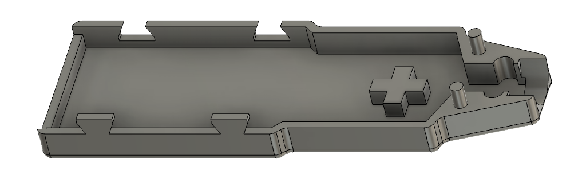

# I2C Soil Moisture Sensor Integration for ESPHome

This is the [ESPHome](https://github.com/esphome/esphome) external component for integration with the [I2C Moisture Sensor](https://github.com/Miceuz/i2c-moisture-sensor). The sensor measures soil moisture, temperature, and light intensity.

## Example

```yaml
external_components:
  - source:
      type: git
      url: https://github.com/diptanw/esphome-i2c-sensor
      ref: main
    components: [ chirp ]

i2c:
  sda: D1
  scl: D2

sensor:
  - platform: chirp
    moisture:
      name: "Soil Moisture"
      calibration:
        min_capacity: 290
        max_capacity: 550
    temperature:
      name: "Soil Temperature"
      calibration:
        offset: -1
    illuminance:
      name: "Ambient Light"
      calibration:
        coefficient: -1.526
        constant: 100000
    version:
      name: "Firmware"
      address: 0x21
    update_interval: 5s
    address: 0x20
```

## Configuration Options

- **Moisture**:
  - `calibration`:
    - `min_capacity`: Lower calibration point for moisture (default 290).
    - `max_capacity`: Upper calibration point for moisture (default 550).

    Place the sensor in dry soil to find the minimum moisture level or in water-saturated soil for the maximum level. Adjust the `min_capacity` and `max_capacity` accordingly.

- **Temperature**:
  - `calibration`:
    - `offset`: Temperature correction in Celsius if the sensor reads too high or low.

    If you have a known temperature source, compare and adjust the `offset` to match the known temperature.

- **Illuminance**:
  - `calibration`:
    - `coefficient`: Coefficient to adjust the light reading linearly.
    - `constant`: Constant to fine-tune light readings.

    Adjust the `coefficient` and `constant` based on known light conditions (e.g., direct sunlight vs. dark room).

- **Version**
  - `address`: Optionally specify a new I2C address for the sensor if the default conflicts with another device on your I2C bus. This must be done before other devices on the bus are initialized to avoid conflicts. After addres is changed, set the new address to `address` field of i2c device.

## Callibration

### Illuminance Conversion Formula

The conversion from sensor readings to lux is based on the principle that the sensor output is inversely proportional to light intensity. This relationship is quantified with a linear equation derived from known calibration points:

- **Pitch Black**: Sensor reading = 65535, Lux = 0
- **Direct Sunlight**: Sensor reading = 0, Lux = 100,000 lux

#### Conversion Formula

The lux value can be calculated from the sensor reading using the formula:

```Lux = m * Sensor Reading + c```

we calculate:

- **Coefficient (m)**: `-1.526`
- **Constant (c)**: `100,000`

## Documentation

For additional details and troubleshooting, visit the [ESPHome Documentation](https://esphome.io).

Learn more about the sensor hardware at [I2C Moisture Sensor GitHub Repository](https://github.com/Miceuz/i2c-moisture-sensor).

## Acknowledgments

Thanks to Miceuz for the Chirp sensor and to ESPHome for the integration platform.

## Print Model

Additionally, there are models for 3D printing the casing for the sensor, which consists of two parts: top and bottom.

 
